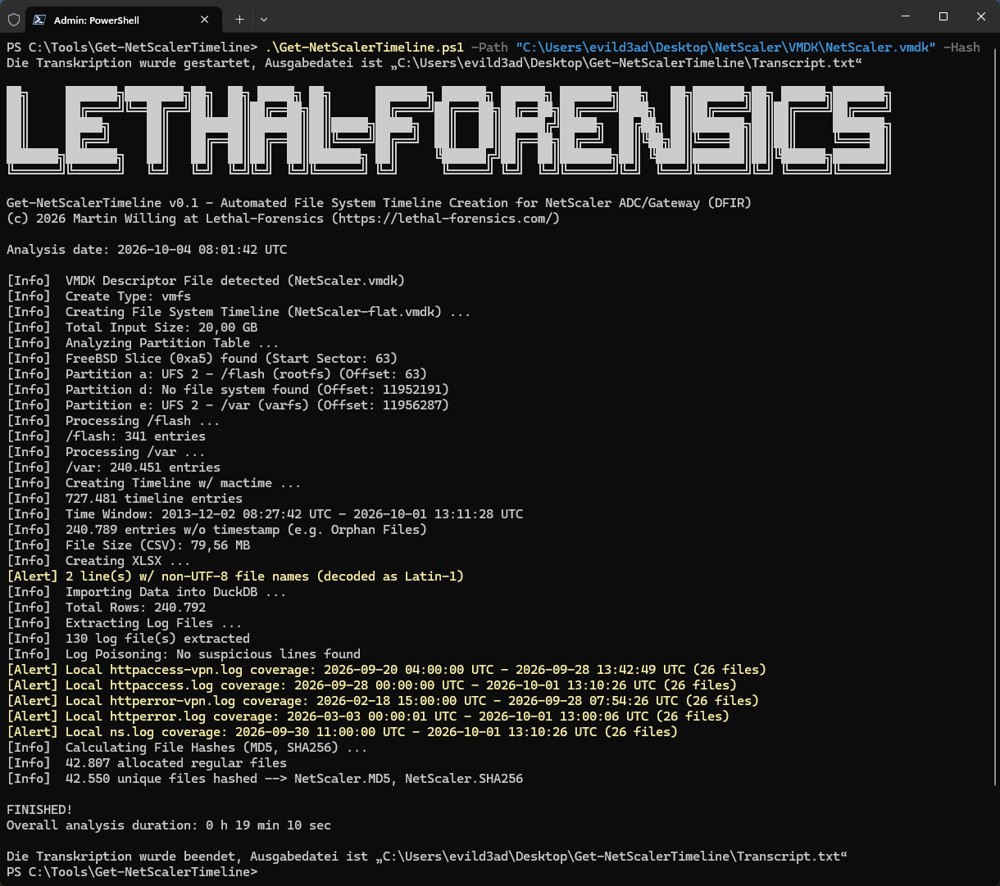
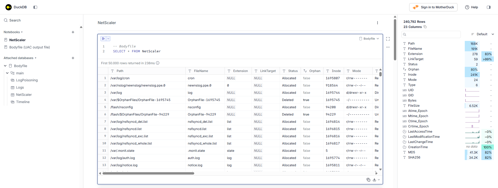
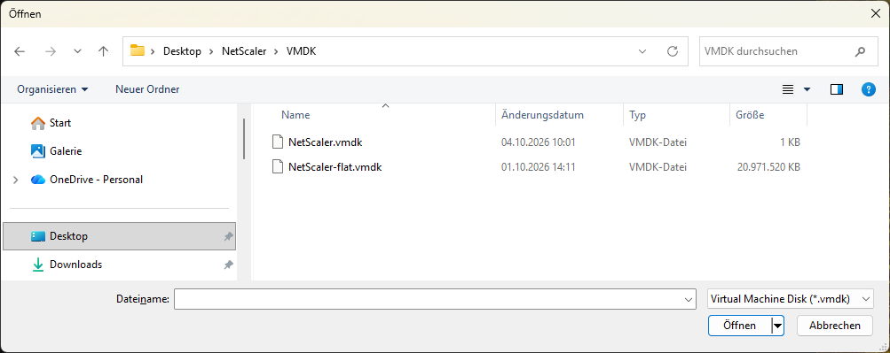
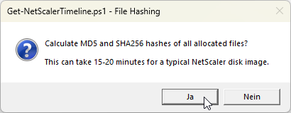
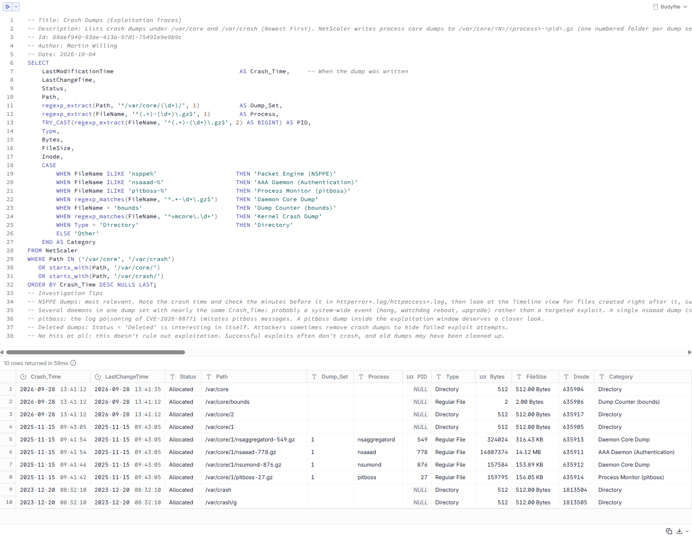

<p align="center"><a href="https://github.com/PowerShell/PowerShell"></a> <a href="https://github.com/LETHAL-FORENSICS/Get-NetScalerTimeline/releases/latest"></a>   <a href="https://x.com/LETHAL_DFIR"></a></p>  

# Get-NetScalerTimeline

Automated File System Timeline Creation for NetScaler ADC/Gateway (DFIR)

Get-NetScalerTimeline.ps1 is a PowerShell script utilized to simplify the creation of a File System Timeline of a NetScaler VMDK Disk Image (UFS). The results are imported into [DuckDB](https://duckdb.org/) for fast threat hunting with SQL, including the persistent locations used by web shells and the log poisoning technique of CVE-2026-88771.

  
**Fig 1:** Get-NetScalerTimeline  

## Features

* **Automatic Partition Detection:** Detects the FreeBSD Slice (0xa5) and all UFS partitions in its BSD Disk Label (e.g. `/flash` and `/var`), incl. their mount points
* **VMDK Support:** Flat extent (`*-flat.vmdk`) or descriptor file (`*.vmdk`) of a flat/VMFS disk, incl. split images (multiple extents)
* **File System Timeline:** Bodyfile (fls) and timeline (mactime) in UTC, ISO 8601, as CSV and XLSX
* **DuckDB Database:** Bodyfile import with file type, status (allocated/deleted), orphan files, symbolic link targets and human-readable timestamps (UTC)
* **Log Extraction:** Extracts `ns.log`, `httpaccess*.log` and `httperror*.log` (incl. rotated `.gz` archives) directly from the image, byte-for-byte, with SHA256 hashes of the evidence copies
* **Log Poisoning Detection (CVE-2026-88771):** Searches the extracted logs for fake `pitboss` heartbeat messages followed by shell operators
* **Log Coverage:** Reports how far back the local logs go, because NetScaler rotates its logs quickly
* **File Hashing (optional):** MD5 and SHA256 of all allocated regular files, read directly from the image and hashed in memory (no files are extracted)
* **Robust Handling of Evidence Data:** Native tool output is written byte-for-byte (no re-encoding by PowerShell), non-UTF-8 file names are preserved, pipe characters in file names are handled
* **DuckDB UI:** Launches the DuckDB UI (interactive notebooks) at the end of the analysis

## Requirements

| Dependency | Version (tested) | Download |
| --- | --- | --- |
| The Sleuth Kit (TSK) | 4.14.0 | https://www.sleuthkit.org/sleuthkit/download.php |
| Strawberry Perl | 5.42.3.1 | https://strawberryperl.com/ |
| DuckDB CLI | 1.5.6 | https://duckdb.org/install/?platform=windows&environment=cli |
| ImportExcel (PowerShell Module) | 7.8.10 | https://github.com/dfinke/ImportExcel |

Tested on Windows 11 Pro (x64) with Windows PowerShell 5.1 and PowerShell 7.6.6.

## Evidence Collection

> [!IMPORTANT]
> Collect volatile data first: Generate an NSPPE Core Dump before imaging the NetScaler ([Link](https://support.citrix.com/external/article/CTX207598/how-to-generate-nsppe-core-dump-on-netsc.html)).
> Generating the NSPPE Core Dump **restarts the NetScaler** and wipes the RAM disk (e.g. `/etc`, `/netscaler`). Collect the live system with a triage script (see tip below) **before** generating the core dump.

> [!WARNING]
> The NSPPE Core Dump is written to `/var/core`, so check free space on `/var` first. [Link](https://docs.netscaler.com/en-us/citrix-adc/current-release/system/troubleshooting-citrix-adc/how-to-free-space-on-var-directory.html)  

> [!TIP]
> The RAM disk (e.g. `/etc`, `/netscaler`) is not part of the VMDK. Collect it from the live system with a triage script such as [UAC](https://github.com/tclahr/uac) or [easy_triage](https://github.com/msuhanov/easy_triage) (`easy_triage_fbsd.sh`). Note: easy_triage saves selected `/etc` files as text files (e.g. `etc_httpd_conf.txt`) and records a timeline of the RAM disk, but does not copy `/netscaler`.

## Installation

1. Download or clone this repository, e.g. to `C:\Tools\Get-NetScalerTimeline`.
2. Download and copy **The Sleuth Kit** to `C:\Tools\sleuthkit`. The script expects the binaries in `C:\Tools\sleuthkit\bin` (`fls.exe`, `fsstat.exe`, `icat.exe`, `mmls.exe`, `mactime.pl`).

   > **Note:** The TSK binaries for Windows are not standalone. Always keep the complete `bin` folder incl. all DLLs, otherwise the tools fail to start.

3. Install **Strawberry Perl** to `C:\Strawberry` (required for `mactime.pl`).
4. The **DuckDB CLI** is included in this repository (`Tools\DuckDB\duckdb.exe`). No installation required.
5. Install the **ImportExcel** module:

   ```powershell
   Install-Module -Name ImportExcel -Scope CurrentUser
   ```

6. Optional: Adjust the Excel color scheme in `Config.json`.

Folder structure:

```
Get-NetScalerTimeline\
├── Get-NetScalerTimeline.ps1
├── Config.json
├── Functions\
│   ├── ConvertTo-Utf8Bodyfile.ps1
│   └── Get-FileSize.ps1
├── Queries\
│   ├── Bodyfile.sql
│   ├── Hashes.sql
│   └── Logs.sql
└── Tools\
    └── DuckDB\
        └── duckdb.exe
```

  
**Fig 2:** MD5 and SHA256 File Hashing of all allocated regular files  

  
**Fig 3:** DuckDB UI is launched at the end of the analysis  

  
**Fig 4:** Message Box  

## Usage

Run the script in an elevated PowerShell session.

Interactive mode (file dialog, the script asks whether to calculate file hashes):

```powershell
.\Get-NetScalerTimeline.ps1
```

Flat extent or descriptor file:

```powershell
.\Get-NetScalerTimeline.ps1 -Path "$env:USERPROFILE\Desktop\NetScaler\VMDK\NetScaler-flat.vmdk"
```

Incl. MD5 and SHA256 file hashes:

```powershell
.\Get-NetScalerTimeline.ps1 -Path "$env:USERPROFILE\Desktop\NetScaler\VMDK\NetScaler-flat.vmdk" -Hash
```

Limit the timeline (CSV/XLSX) to a date range:

```powershell
.\Get-NetScalerTimeline.ps1 -Path "$env:USERPROFILE\Desktop\NetScaler\VMDK\NetScaler-flat.vmdk" -StartDate 2026-09-01 -EndDate 2026-10-01
```

### Parameters

| Parameter | Description |
| --- | --- |
| `-Path` | Optional. Path to the VMDK: flat extent (`*-flat.vmdk`) or descriptor file (`*.vmdk`) of a flat/VMFS disk. If omitted, a file dialog opens. |
| `-OutputDir` | Optional. Output directory. Default: `$env:USERPROFILE\Desktop\Get-NetScalerTimeline` (the subdirectory `Get-NetScalerTimeline` is created automatically). |
| `-Hash` | Optional. Calculates MD5 and SHA256 of all allocated regular files. Each file is read by a separate icat process, which can take 15-20 minutes for a typical NetScaler disk image. |
| `-StartDate` | Optional. Only include events on or after this date (yyyy-MM-dd, UTC). |
| `-EndDate` | Optional. Only include events on or before this date (yyyy-MM-dd, UTC). |

> **Note:** `-StartDate`/`-EndDate` only limit the mactime timeline (CSV/XLSX). The DuckDB database always contains the complete bodyfile.

  
**Fig 5:** File Dialog Browser (Interactive Mode)   

  
**Fig 6:** The script asks whether to calculate MD5 and SHA256 hashes (Interactive Mode)  

## Output

```
Get-NetScalerTimeline\
├── Transcript.txt
├── mmls\                       Partition table and BSD disk label
├── fsstat\                     File system details per UFS partition
├── fls\                        Bodyfiles (per partition, combined, UTF-8)
├── Timeline\
│   ├── 2-mactime-timeline.csv  File system timeline (UTC, ISO 8601)
│   ├── NetScalerTimeline.xlsx  (if below the Excel row limit)
│   └── DuckDB\Database\Bodyfile.duckdb
├── Logs\
│   ├── raw\                    Extracted logs (byte-for-byte evidence copies)
│   ├── utf8\                   Decompressed UTF-8 working copies
│   └── SHA256.csv
└── Hashes\                     (-Hash only)
    └── FileHashes.csv
```

### DuckDB

| Object | Type | Description |
| --- | --- | --- |
| `NetScaler` | Table | One row per bodyfile entry: path, file name, extension, link target, status, orphan flag, inode, mode, type, UID/GID, size, timestamps (UTC), MD5, SHA256 |
| `Timeline` | View | One row per timestamp (Accessed, Modified, Changed, Birth) — the basis for time window queries |
| `Logs` | Table | All lines of the extracted logs incl. file name and line number |
| `LogPoisoning` | View | Log lines matching the log poisoning pattern of CVE-2026-88771 |

Example:

```sql
-- All file system events between two timestamps (UTC)
SELECT *
FROM Timeline
WHERE Timestamp >= TIMESTAMP '2026-09-01 00:00:00'
  AND Timestamp <  TIMESTAMP '2026-09-14 00:00:00'
ORDER BY Timestamp;
```

  
**Fig 7:** DuckDB UI: Crash Dumps (Exploitation Traces)  

> [!TIP]
> More threat hunting queries (web shells, persistence, crash dumps, log tampering, CVE-2026-88771/88772 IOCs) can be found in [Queries.md](Queries.md). Happy Hunting!

## Contributing

Contributions are welcome, especially threat hunting queries from the DFIR community.  

To share a query:

1. Create a `.sql` file with the same header as the existing queries:

   ```sql
   -- Title: <Short, descriptive title>
   -- Description: <What the query shows, why it matters, how to read the results>
   -- Id: <GUID, e.g. (New-Guid).Guid in PowerShell>
   -- Author: <Your name>
   -- Date: <yyyy-MM-dd>
## Notes and Limitations

* **Disk image only:** The root file system of a NetScaler (e.g. `/etc`, `/netscaler`) is a RAM disk that is rebuilt at every boot and is **not** part of the VMDK. Only the persistent file systems `/flash` and `/var` are analyzed. Web shells under `/netscaler/ns_gui` or a modified `/etc/httpd.conf` must be collected from the live system.
* **No birth time:** TSK 4.14 does not parse the UFS2 birth time, so `CreationTime` is always empty. Use `LastChangeTime` (ctime) for sorting. Unlike mtime and atime, it cannot be set from user space (e.g. `touch`).
* **Apache restarts update timestamps:** At every Apache start, NetScaler touches files under `/var/netscaler/logon/` that are older than 34 days. Clusters of identical timestamps there are expected.
* **Log retention:** NetScaler rotates its logs quickly. "No suspicious lines found" only refers to the reported log coverage. Older events may only be available in SIEM/Syslog.
* **Sparse VMDKs** (e.g. `monolithicSparse`, `streamOptimized`) are not supported. Convert them to RAW first (e.g. `qemu-img convert -O raw`).
* **Snapshots:** If the descriptor references a parent disk (delta disk), only the delta is analyzed.
* **Deleted files** are listed in the timeline, but not hashed or extracted, because their data blocks may already be reallocated. 

## Links
[Unix-like Artifacts Collector (UAC) by Tiago Lahr](https://github.com/tclahr/uac)  
[easy_triage_fbsd.sh by Maxim Suhanov](https://github.com/msuhanov/easy_triage/blob/main/easy_triage_fbsd.sh)  
[ctx697096_check.sh by Thomas Poppelgaard](https://github.com/ThomasPoppelgaard/netscaler-ctx697096-checker)  
[netscaler-ioc-check.sh by Manuel Winkel](https://github.com/Deyda/Security/blob/main/deyda-netscaler-ioc-check.sh)  
[CVE-2026-88771 through CVE-2026-88778, what you should know and how to fix your NetScaler](https://www.poppelgaard.com/cve-2026-88771-through-cve-2026-88778-what-you-should-know-and-how-to-fix-your-netscaler-adc-netscaler-gateway)  
[NetScaler CVE Checklist: Updates, Security Assessment and Incident Response](https://www.deyda.net/index.php/en/2026/08/28/netscaler-cve-checklist-updates-security-assessment-and-incident-response/)  
